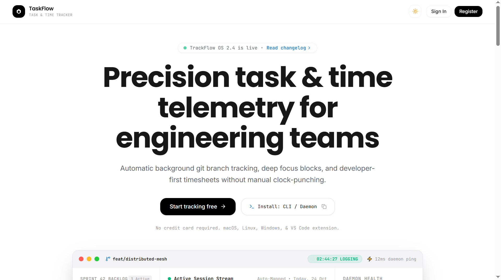

# ⚡ TaskFlow — Developer Task & Time Telemetry Platform

> An engineering-grade task management and real-time time telemetry tracking system built with React 19, TypeScript, Tailwind CSS v4, Node.js, Express, and Neon Serverless PostgreSQL.

---

## 📸 Overview & Preview



TaskFlow bridges the gap between task management and active time tracking. It provides automated branch and task association, live stopwatch session tracking with drift prevention, a GitHub-style annual contribution matrix, and role-based administrative oversight.

### 🔗 Live Deployments & Demos
* **Demo Credentials:**
  * **Standard Engineer:** `user@taskflow.com` / `User@1234`
  * **System Admin:** `admin@taskflow.com` / `Admin@1234`

---

## 🛠️ Tech Stack

### Frontend
* **Core:** React 19, TypeScript, Vite
* **Styling & Design Tokens:** Tailwind CSS v4 with dynamic CSS variable layers (Light & Dark mode parity)
* **Data Fetching & Cache:** TanStack React Query v5
* **Client State Management:** Zustand v5 (Persistent Auth, Theme, and Timestamp-based Timer Engine)
* **Forms & Validation:** Formik & Yup
* **Routing & Security:** React Router DOM v7 with LazyLoading Suspense and Role Guards
* **Icons & Feedback:** Lucide React, React Hot Toast

### Backend
* **Runtime & Framework:** Node.js (ES Modules), Express.js
* **Database:** Neon PostgreSQL with Connection Pooling (`pg`)
* **Authentication:** JWT (Short-lived Access Token + Cryptographically hashed long-lived Refresh Token Rotation in HttpOnly cookies)
* **Input Validation:** Joi Validation Middlewares
* **Email & Transports:** Nodemailer SMTP (Gmail Integration for 6-digit OTP verification and password recovery alerts)
* **API Documentation:** Swagger UI Express & OpenAPI 3.0

---

## 🚀 Key Features

* **Complete Identity Lifecycle:**
  * User registration with 6-digit OTP verification dispatched via SMTP.
  * Session token rotation, secure cookie transport, and remote session revocation.
  * Self-service password recovery using hashed single-use OTPs.

* **Task Management Engine:**
  * Filter by task status (`PENDING`, `IN_PROGRESS`, `COMPLETED`) and priority (`LOW`, `MEDIUM`, `HIGH`).
  * Built-in Natural Language Processing (NLP) assistant to suggest structured deliverables and urgency levels from raw prompts.
  * Scoped data isolation ensuring users only access their personal workspaces.

* **Live Stopwatch & Time Logging:**
  * Single active running timer rule enforced at the database level.
  * Timestamp-driven client stopwatch engine that eliminates browser tab background interval drift.
  * Historical time log auditing with manual duration entry and date range filtering.

* **Productivity Analytics & Dashboard:**
  * Daily summary snapshot showing active tasks, session counts, and total minutes.
  * Annual activity heatmap matrix categorizing daily focus intensity (`Blank`, `1–5`, `6–10`, `10+` sessions).
  * Consecutive day streak counter (current streak, longest streak, total active days).

* **Administrative Oversight (Admin Role Only):**
  * System-wide platform metrics (total users, active timers, aggregate hours logged).
  * Searchable user management directory with active/suspend account toggles and cascading account deletion.

---

## 📂 Repository Structure

```text
├── backend/
│   ├── src/
│   │   ├── common/           # Custom AppError, async handlers, standard response format
│   │   ├── config/           # Database pool & environment variable loaders
│   │   ├── database/         # SQL migration scripts & demo seeder utility
│   │   ├── docs/             # OpenAPI 3.0 Swagger specifications
│   │   ├── middlewares/      # JWT auth guard, RBAC roles, Joi validation
│   │   ├── modules/
│   │   │   ├── admin/        # Platform stats and user management
│   │   │   ├── auth/         # Authentication, OTPs, session models
│   │   │   ├── dashboard/    # Consolidated telemetry and heatmap aggregations
│   │   │   ├── task/         # Task CRUD and NLP parser service
│   │   │   └── timetrack/    # Stopwatch timers and duration calculators
│   │   ├── shared/           # Nodemailer transport service
│   │   └── server.js         # HTTP server bootstrap
│   └── package.json
│
├── frontend/
│   ├── src/
│   │   ├── common/           # Shared UI buttons, tables, dropdowns, modal primitives
│   │   ├── constants/        # API endpoints and route URLs
│   │   ├── hooks/            # Global custom hooks (useStopwatch, useDebounce)
│   │   ├── modules/          # Feature modules (auth, tasks, timetrack, dashboard, profile, users)
│   │   │   └── [module]/     # Sub-divided into /api, /components, /hooks, /pages, /types
│   │   ├── routes/           # Route configuration and RoleGuard definitions
│   │   ├── store/            # Zustand stores (Auth, Theme, Timer)
│   │   └── utils/            # makeRequest wrapper, formatters, and Yup schemas
│   └── package.json
└── overview.png              # Architectural / Dashboard preview image